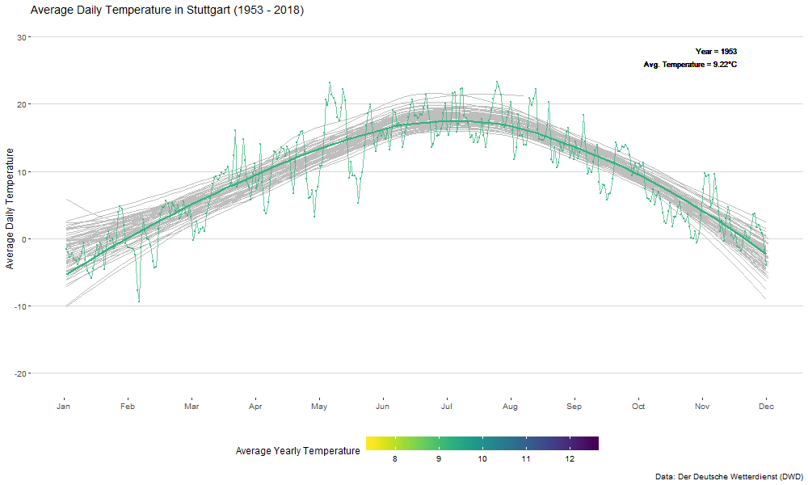
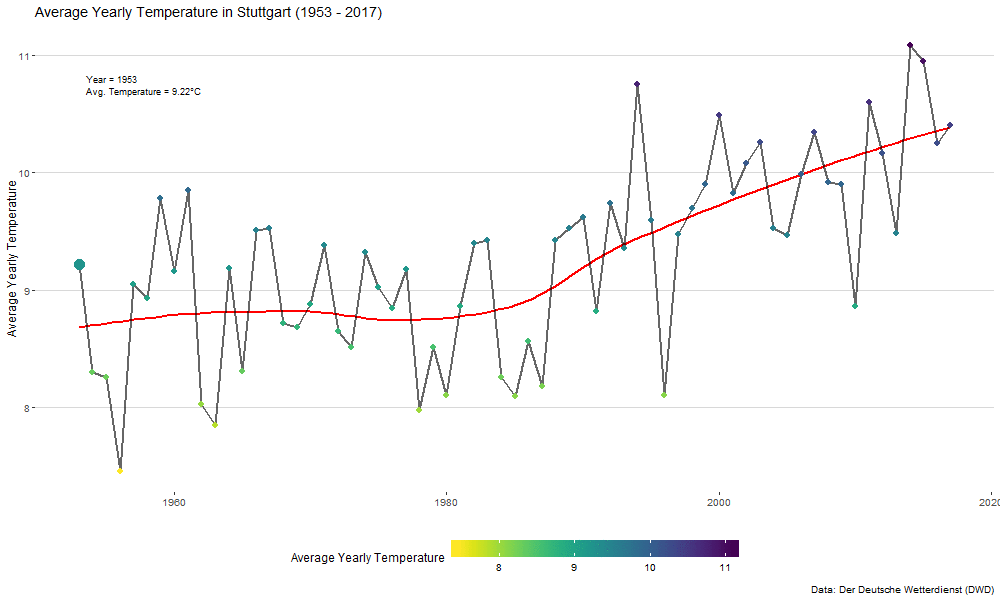

```{r setup, include=FALSE}
knitr::opts_chunk$set(echo = TRUE, warning = F)
```

## Get Packages

```{r}
pacman::p_load(tidyverse, rvest, gganimate)
```


## Get and Save Data

```{r eval = F}
url <- "http://icdc.cen.uni-hamburg.de/las/ProductServer.do?xml=%3C%3Fxml+version%3D%221.0%22%3F%3E%3ClasRequest+href%3D%22file%3Alas.xml%22%3E%3Clink+match%3D%22%2Flasdata%2Foperations%2Foperation%5B%40ID%3D%27DBExtractRowset%27%5D%22%3E%3C%2Flink%3E%3Cproperties%3E%3Cferret%3E%3Ccomponents%3E+grw_m+antdyn_m+greendyn_m+antsmb_m+ocn_m+greensmb_m+glac_m+gia_m%3C%2Fcomponents%3E%3Cview%3Exy%3C%2Fview%3E%3C%2Fferret%3E%3C%2Fproperties%3E%3Cargs%3E%3Cconstraint+id%3D%22undefined%22+type%3D%22text%22%3E%3Cv%3EStations_Kennziffer%3C%2Fv%3E%3Cv%3E%253D%3C%2Fv%3E%3Cv%3E10738%3C%2Fv%3E%3C%2Fconstraint%3E%3Clink+match%3D%22%2Flasdata%2Fdatasets%2Fdwd_data%2Fvariables%2Favg_temp_day%22%3E%3C%2Flink%3E%3Cregion%3E%3Crange+type%3D%22t%22+low%3D%2201-Jan-1876%22+high%3D%2227-Aug-2018%22%3E%3C%2Frange%3E%3Crange+type%3D%22x%22+low%3D%220%22+high%3D%2224%22%3E%3C%2Frange%3E%3Crange+type%3D%22y%22+low%3D%2240%22+high%3D%2259%22%3E%3C%2Frange%3E%3C%2Fregion%3E%3C%2Fargs%3E%3C%2FlasRequest%3E"

temp_stgt <- read_html(url) %>% 
  rvest::html_node("table") %>% html_table()

if(!dir.exists("data")) dir.create("data")

temp_stgt <- temp_stgt %>% 
  janitor::clean_names() %>% 
  rename(avg_temp_day = luftemperatur_avg) %>% 
  mutate(t = lubridate::ymd(t)) %>% 
  mutate(month = lubridate::month(t)) %>% 
  mutate(day = lubridate::yday(t)) %>% 
  arrange(t) %>% 
  mutate(year = lubridate::year(t)) %>% 
  mutate(time = year) %>% 
  group_by(year) %>% 
  mutate(avg_temp_year_year = mean(avg_temp_day)) %>% 
  ungroup()

save(temp_stgt, file = "data/temp_stgt.Rdata")
```

## Plot Temperature (Static)

```{r, fig.width = 10, fig.height=6}
load("data/temp_stgt.Rdata")

months <- c("Jan", "Feb", "Mar", "Apr", "May", "Jun", "Jul", "Aug", "Sep", "Oct", "Nov", "Dec")

temp_stgt %>% 
  # filter(year %in% c(1960, 1970, 1980, 1990, 2000, 2010, 2018)) %>% 
  ggplot(aes(day, avg_temp_day, color = year, group = year)) +
  geom_point(size = .01, alpha = .1) +
  geom_line(size = .01, alpha = .1) +
  geom_smooth(se = F, size = .01, alpha = .2) +
  viridis::scale_color_viridis("Year", direction = -1, discrete = F,
                               breaks = c(1953, 1985, 2018),
                               labels = c(1953, 1985, 2018)) +
  ggthemes::theme_hc() +
  labs(title = "Average Daily Temperature in Stuttgart (1953 - 2018)", 
       caption = "Data: Der Deutsche Wetterdienst (DWD)",
       y = "Average Daily Temperature", x = "") +
  scale_x_continuous(breaks = seq(0, 365, length.out = 12), labels = months) +
  guides(colour = guide_colourbar(barwidth = 20, label.position = "bottom"))

if(!dir.exists("images")) dir.create("images")

ggsave(filename = "images/avg_temp_year.png", height = 6, width = 10)
```


## Animations

### Average Temperature over Time by Day

```{r, fig.width = 10, fig.height=6}

temp_stgt_all <- temp_stgt %>% 
  select(-year)

p1 <- temp_stgt %>% 
  # filter(year %in% c(1960, 1970, 1980, 1990, 2000, 2010, 2018)) %>% 
  ggplot(aes(day, avg_temp_day, color = avg_temp_year, group = year)) +
  geom_smooth(data = temp_stgt_all, aes(day, avg_temp_day, group = time), 
              color = "grey", se = F, size = .1, alpha = .1) +
  geom_point(size = .5, alpha = .7) +
  geom_line(size = .5, alpha = .7) +  
  viridis::scale_color_viridis("Average Yearly Temperature", direction = -1, discrete = F) +
  geom_smooth(se = F, size = 1, alpha = .7) +

  ggthemes::theme_hc()  +
  geom_text(aes(x = 350, y = 28, label = paste0("Year = ", year)), size = 3, 
            hjust = 1, color = "black") +
  geom_text(aes(x = 350, y = 26, 
                label = paste0("Avg. Temperature = ", 
                           sprintf("%.2f", round(avg_temp_year, 2)), "°C")), 
                                  size = 3, color = "black", hjust = 1) +
  # Here comes the gganimate code
  transition_time(
    year
  ) +
  enter_fade() + 
  exit_fade() +
  ease_aes('linear') +
  labs(title = "Average Daily Temperature in Stuttgart (1953 - 2018)", 
       caption = "Data: Der Deutsche Wetterdienst (DWD)",
       y = "Average Daily Temperature", x = "") +
  scale_x_continuous(breaks = seq(0, 365, length.out = 12), labels = months) +
  guides(colour = guide_colourbar(barwidth = 20, label.position = "bottom"))

magick::image_write(
  image = animate(p1,  width = 1000, height = 600, renderer = magick_renderer(), length = 45), 
  path = "images/daily_temp.gif"
)
```
<!-- -->

### Average Temperature over Time by Year

```{r, fig.width = 10, fig.height=6}
temp_stgt_allyear <- temp_stgt %>% 
  filter(year != 2018) %>%
  group_by(year) %>% 
  summarise(avg_temp_year = mean(avg_temp_year)) %>% 
  mutate(time = year) %>% 
  select(-year)

p2 <- temp_stgt %>% 
  filter(year != 2018) %>%
  group_by(year) %>% 
  summarise(avg_temp_year = mean(avg_temp_year)) %>% 
  ggplot(aes(year, avg_temp_year)) +
  geom_smooth(data = temp_stgt_allyear, aes(time, avg_temp_year), 
              color = "red", se = F, size = .8) +
  geom_line(data = temp_stgt_allyear, aes(time, avg_temp_year), 
              color = "black", size = .8, alpha = .6) +
  geom_point(data = temp_stgt_allyear, aes(time, avg_temp_year, color = avg_temp_year), size = 2.5) +
  geom_point(aes(color = avg_temp_year), size = 5) +
  ggthemes::theme_hc()  +
  geom_text(aes(x = 1953.5, y = 10.8, 
                label = paste0("Year = ", year)), 
                size = 3, color = "black",
                hjust = 0) +
  geom_text(aes(x = 1953.5, y = 10.7, 
                label = paste0("Avg. Temperature = ", 
                           sprintf("%.2f", round(avg_temp_year, 2)), "°C")), 
                                  size = 3, color = "black", hjust = 0) +
  viridis::scale_color_viridis("Average Yearly Temperature", direction = -1, discrete = F) +
  # Here comes the gganimate code
  transition_time(
    year
  ) +
  enter_fade() + 
  exit_fade() +
  ease_aes('linear') +
  ease_aes('linear') +
  labs(title = "Average Yearly Temperature in Stuttgart (1953 - 2017)", 
       caption = "Data: Der Deutsche Wetterdienst (DWD)",
       y = "Average Yearly Temperature", x = "") +
  guides(colour = guide_colourbar(barwidth = 20, label.position = "bottom"))

magick::image_write(
  image = animate(p2,  width = 1000, height = 600, renderer = magick_renderer(), length = 45), 
  path = "images/yearly_temp.gif"
)

```


<!-- -->

